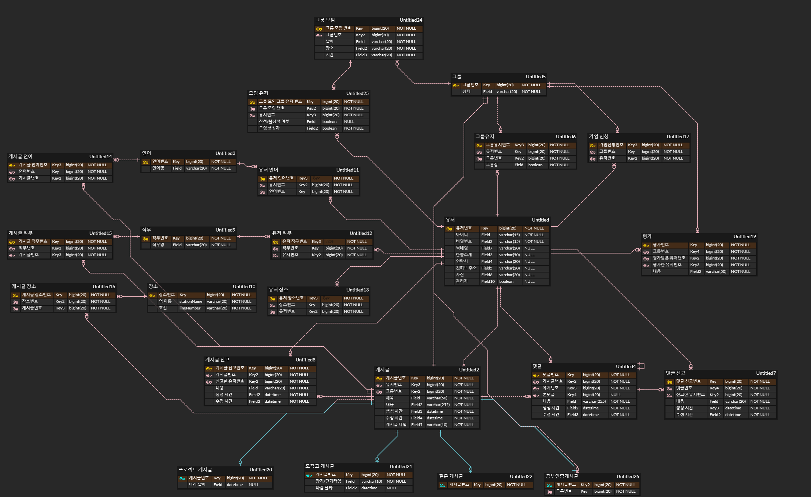

# 모각코/프로젝트를 구하고 관리할 수 있는 웹서비스(server)

### 일정
- 2022-11-01 ~ 2022-11-07 : 프로젝트 주제 선정
- 2022-11-07 ~ 2022-11-13 : 기획
- 2022-11-13 ~ 2022-11-20 : 세부요구사항 회의 및 작성
- 2022-11-20 ~ 2022-12-01 : er diagram 작성
- 2022-12-01 ~ 2022-12-23 : api 명세서 작성

### 사용 기술
- 백엔드 : Java Spring, jpa
- 프론트엔드 : React
- database : MySQL, aws rds
- 서버 배포 : aws ec2

### 요구사항 분석
https://www.notion.so/11-13-6204653820c54bde9a2a7c2430584fb5

### db 설계

### API 설계
https://www.notion.so/API-70fe64361c8149b983b2d36e35329f9c
- RESTful한 api를 작성하려 노력하였습니다.

### 화면
